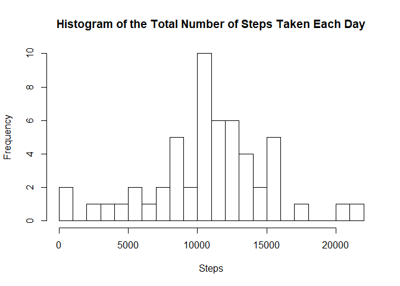
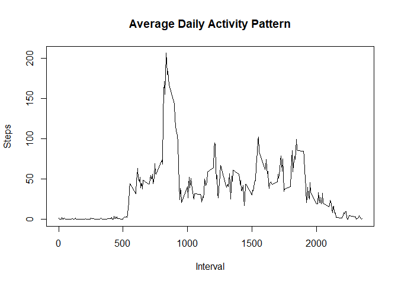
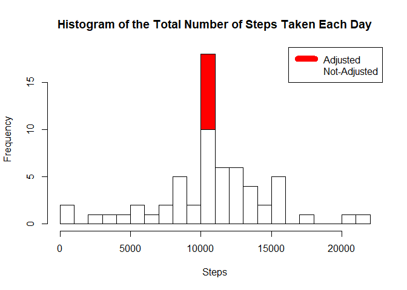
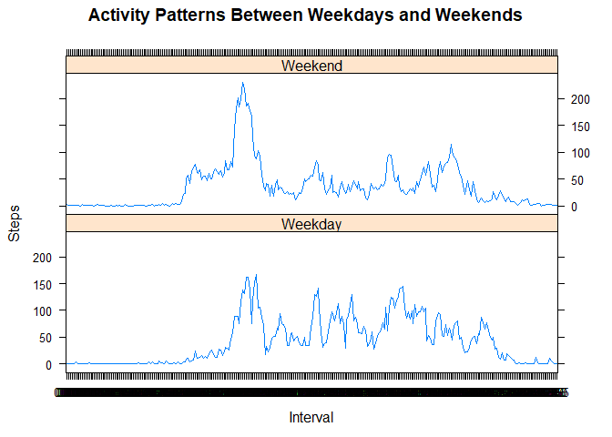

# Reproducible Research: Peer Assessment 1


## Loading and preprocessing the data


```r
## Download the file
dataurl <- "https://d396qusza40orc.cloudfront.net/repdata%2Fdata%2Factivity.zip"
datafile <- "data_factivity.zip"

if(!file.exists(datafile)) 
{
    download.file(dataurl, datafile)
    unzip(datafile)
}

# Load file
activity <- read.csv("activity.csv")

# Ajust date format
activity$interval <- paste('0000',activity$interval, sep = '')
activity$interval <- substr(activity$interval, nchar(activity$interval)-4+1, nchar(activity$interval))
activity$complete_date <- parse_date_time(paste(activity$date,activity$interval), orders="ymd HM")
```

## What is mean total number of steps taken per day?

A histogram of the total number of steps taken each day


```r
steps_day <- activity %>%
    group_by(date) %>%
    summarise(steps = sum(steps))

hist(steps_day$steps, main = "Histogram of the Total Number of Steps Taken Each Day", xlab = "Steps", breaks = 25)
```

<!-- -->

Mean total number of steps taken per day


```r
mean(steps_day$steps, na.rm = TRUE)
```

```
## [1] 10766.19
```

Median total number of steps taken per day


```r
median(steps_day$steps, na.rm = TRUE)
```

```
## [1] 10765
```

## What is the average daily activity pattern?


```r
steps_interval <- activity %>%
    group_by(interval) %>%
    summarise(steps = mean(steps, na.rm = TRUE))

plot(steps_interval$interval,steps_interval$steps, type="l", xlab="Interval", ylab="Steps",main="Average Daily Activity Pattern")
```

<!-- -->

The 5-minute interval, on average across all the days in the dataset, that contains the maximum number of steps is:


```r
steps_interval[which.max(steps_interval$steps),1]
```

```
## # A tibble: 1 × 1
##   interval
##      <chr>
## 1     0835
```


## Imputing missing values

There are some missing values:


```r
sum(!complete.cases(activity))
```

```
## [1] 2304
```

```r
percent <- sum(!complete.cases(activity))/nrow(activity)
paste(round(100*percent, 2), "%", sep="")
```

```
## [1] "13.11%"
```

The missing values will be filled with mean for that 5-minute interval


```r
activityFull <- activity
activityFull <- merge(activityFull,steps_interval, by.x = "interval", by.y = "interval")
activityFull$steps.x[is.na(activityFull$steps.x)] <- activityFull$steps.y[is.na(activityFull$steps.x)]
activityFull <- activityFull %>%
    select(steps = steps.x, interval,date,complete_date)

activityFull_day <- activityFull %>%
    group_by(date) %>%
    summarise(steps = sum(steps))

hist(activityFull_day$steps, main = "Histogram of the Total Number of Steps Taken Each Day", xlab = "Steps", col="red", breaks = 25)
hist(steps_day$steps, main = "Histogram of the Total Number of Steps Taken Each Day", xlab = "Steps", col="white", breaks = 25,add=T)
legend("topright", c("Adjusted", "Not-Adjusted"), col=c("red", "white"), lwd=10)
```

<!-- -->


Mean total number of steps taken per day


```r
mean(activityFull_day$steps, na.rm = TRUE)
```

```
## [1] 10766.19
```

```r
mean(steps_day$steps, na.rm = TRUE) - mean(activityFull_day$steps, na.rm = TRUE)
```

```
## [1] 0
```

Median total number of steps taken per day


```r
median(activityFull_day$steps, na.rm = TRUE)
```

```
## [1] 10766.19
```

```r
median(steps_day$steps, na.rm = TRUE) - median(activityFull_day$steps, na.rm = TRUE)
```

```
## [1] -1.188679
```

## Are there differences in activity patterns between weekdays and weekends?


```r
weekend <- c("Sun", "Sat")

activityFull$week = as.factor(ifelse(!is.element(wday(activityFull$complete_date, label = TRUE),weekend), "Weekend", "Weekday"))

activityFull_week <- activityFull %>%
    group_by(week,interval) %>%
    summarise(steps = mean(steps, na.rm = TRUE))

activityFull_week$interval <- as.factor(activityFull_week$interval)

xyplot(activityFull_week$steps ~ activityFull_week$interval|activityFull_week$week, type="l",main="Activity Patterns Between Weekdays and Weekends",xlab="Interval", ylab="Steps",layout=c(1,2))
```

<!-- -->
